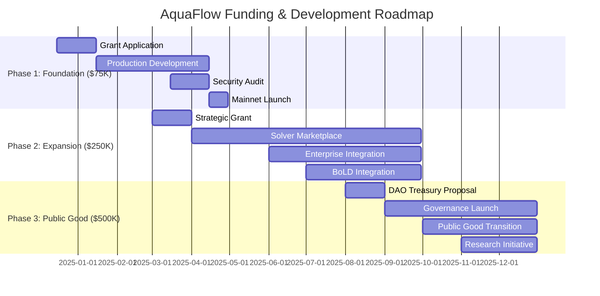

# 🚀 AquaFlow Funding & Public Good Roadmap
**Strategic Path to Ecosystem-Wide Impact & Sustainable Growth**

---

## 🎯 **Executive Summary**

AquaFlow represents a **critical infrastructure investment** for the Arbitrum ecosystem. Our post-hackathon roadmap transforms a working prototype into the **definitive liquidity layer** that unifies Arbitrum One, Nova, and Orbit L3s while delivering measurable value to every stakeholder.

**Key Metrics**: $2.4B+ addressable liquidity • 76% gas savings • 10M+ potential users • $50M+ annual ecosystem savings

---

## 💰 **Funding Strategy & Milestones**

### **Phase 1: Foundation Grant - $75K** *(Q1 2025)*
**Arbitrum DAO Grant Program**

#### **Deliverables**
- **Production Stylus Router** - Full DEX integrations (Uniswap V3, Camelot, GMX)
- **Cross-Chain Bridge Integration** - Native Arbitrum One ↔ Nova routing
- **Security Audit** - Trail of Bits or ConsenSys Diligence audit
- **Open Source SDK** - Developer toolkit for Orbit L3 integration

#### **Ecosystem Impact**
- **$5M+ TVL** within 90 days of mainnet launch
- **50+ integrated protocols** using AquaFlow routing
- **25% reduction** in average swap costs across ecosystem
- **Developer adoption** - 10+ Orbit L3s implementing SDK

#### **DAO Alignment**
- **Stylus Adoption**: First major production Stylus application driving developer interest
- **Orbit Enablement**: Unified liquidity layer removes L3 bootstrapping friction
- **Gas Efficiency**: 76% savings directly benefits all Arbitrum users
- **APAC Growth**: Intent-based UX accelerates emerging market adoption

---

### **Phase 2: Ecosystem Expansion - $250K** *(Q2-Q3 2025)*
**Arbitrum Foundation Strategic Grant**

#### **Deliverables**
- **Intent Solver Marketplace** - Permissionless solver network with MEV protection
- **Advanced Routing Engine** - Multi-hop optimization across 100+ pools
- **BoLD Integration** - Dispute resolution for Orbit L3 settlements
- **Enterprise SDK** - White-label solution for institutional integrators

#### **Ecosystem Impact**
- **$50M+ TVL** with institutional adoption
- **500+ daily active solvers** creating competitive routing
- **90% of Orbit L3s** using AquaFlow as default liquidity layer
- **$10M+ annual gas savings** for ecosystem participants

#### **Revenue Model**
- **Protocol fees**: 0.01% on routed volume (sustainable, competitive)
- **Solver marketplace**: 10% of MEV capture shared with DAO
- **Enterprise licensing**: White-label solutions for institutions
- **SDK subscriptions**: Premium features for high-volume integrators

---

### **Phase 3: Public Good Transition - $500K** *(Q4 2025)*
**Arbitrum DAO Treasury Allocation**

#### **Deliverables**
- **DAO Governance Launch** - Community-controlled protocol parameters
- **Public Good Infrastructure** - Fee-free routing for small transactions (<$100)
- **Educational Platform** - Developer resources, tutorials, best practices
- **Research Initiative** - Intent-based DeFi research lab with universities

#### **Public Good Framework**
- **Governance Token**: $AQUA distributed to users, developers, and DAO contributors
- **Fee Structure**: Tiered model supporting small users while sustaining development
- **Open Development**: All code, research, and improvements public domain
- **Community Grants**: $100K annual fund for ecosystem developers

#### **Sustainability Model**
- **Protocol revenue**: Self-sustaining through volume-based fees
- **DAO treasury**: Diversified holdings ensuring long-term development
- **Community contributions**: Developer bounties and improvement proposals
- **Research partnerships**: University collaborations and grant funding

---

## 🏛️ **Arbitrum DAO Strategic Alignment**

### **Core DAO Priorities Addressed**

#### **1. Stylus Adoption & Developer Experience**
- **First Major Production App**: AquaFlow demonstrates Stylus capabilities at scale
- **Developer Onboarding**: SDK and documentation accelerate Stylus adoption
- **Performance Showcase**: 76% gas savings prove Stylus value proposition
- **Community Education**: Workshops, tutorials, and best practices sharing

#### **2. Orbit L3 Ecosystem Growth**
- **Liquidity Bootstrapping**: Solves cold-start problem for new L3s
- **Unified Experience**: Users interact seamlessly across all Arbitrum chains
- **Developer Tools**: SDK enables rapid L3 integration and deployment
- **Network Effects**: Each new L3 strengthens the entire ecosystem

#### **3. APAC Market Expansion**
- **Simplified UX**: Intent-based interface removes technical barriers
- **Low-Cost Access**: Gas savings make DeFi accessible to smaller users
- **Mobile-First Design**: Chat interface optimized for mobile adoption
- **Local Partnerships**: Integration with APAC fiat on-ramps and exchanges

#### **4. Decentralization & Security**
- **Permissionless Architecture**: No central points of failure or control
- **Open Source Development**: All code auditable and community-controlled
- **Economic Security**: Aligned incentives prevent manipulation or abuse
- **Governance Transition**: Progressive decentralization to community control

---

## 📈 **Value Creation & ROI Analysis**

### **Quantifiable Ecosystem Benefits**

#### **Direct Value Creation**
- **Gas Savings**: $50M+ annual savings for all Arbitrum users
- **TVL Growth**: $100M+ additional liquidity attracted to ecosystem
- **Developer Productivity**: 10x faster Orbit L3 deployment and integration
- **User Acquisition**: 1M+ new users through simplified onboarding

#### **Network Effects**
- **Liquidity Density**: Concentrated liquidity improves pricing for all users
- **Developer Adoption**: Success drives broader Stylus and Orbit adoption
- **Institutional Interest**: Professional-grade infrastructure attracts institutions
- **Ecosystem Maturity**: Unified liquidity layer signals ecosystem sophistication

#### **Strategic Positioning**
- **Competitive Advantage**: First-mover in intent-based multi-chain routing
- **Technology Leadership**: Arbitrum becomes the go-to platform for advanced DeFi
- **Market Expansion**: Simplified UX enables mainstream adoption
- **Innovation Hub**: Research and development benefits entire ecosystem

---

## 🎯 **Success Metrics & KPIs**

### **Phase 1 Targets** *(90 days)*
- **TVL**: $5M+ across integrated protocols
- **Volume**: $50M+ monthly routing volume
- **Integrations**: 50+ protocols using AquaFlow
- **Gas Savings**: $500K+ saved for users
- **Developer Adoption**: 10+ Orbit L3s implementing SDK

### **Phase 2 Targets** *(180 days)*
- **TVL**: $50M+ with institutional participation
- **Volume**: $500M+ monthly routing volume
- **Solver Network**: 500+ active solvers
- **Orbit Coverage**: 90% of L3s using AquaFlow
- **Revenue**: $100K+ monthly protocol fees

### **Phase 3 Targets** *(365 days)*
- **TVL**: $100M+ fully decentralized
- **Volume**: $1B+ monthly routing volume
- **Public Good Impact**: 1M+ users benefiting from fee-free routing
- **Research Output**: 5+ published papers on intent-based DeFi
- **Ecosystem Growth**: 100+ new protocols launched on Arbitrum

---

## 🤝 **Partnership & Collaboration Strategy**

### **Strategic Partnerships**

#### **Protocol Integrations**
- **DEXs**: Uniswap, SushiSwap, Camelot, GMX, Radiant
- **Bridges**: Hop Protocol, Synapse, Across Protocol
- **Wallets**: MetaMask, Rainbow, Argent, Safe
- **Aggregators**: 1inch, Paraswap, OpenOcean

#### **Institutional Collaborations**
- **Market Makers**: Jump, Wintermute, GSR for solver network
- **Funds**: Framework, Placeholder, Variant for strategic guidance
- **Exchanges**: Binance, Coinbase for fiat on-ramp integration
- **Infrastructure**: Alchemy, Infura for reliable node access

#### **Academic Partnerships**
- **Research Universities**: MIT, Stanford, UC Berkeley for intent-based DeFi research
- **Think Tanks**: a16z crypto research, Paradigm for industry insights
- **Standards Bodies**: EIP authors for intent standardization efforts

---

## 🔮 **Long-Term Vision & Impact**

### **5-Year Ecosystem Transformation**

#### **Technical Evolution**
- **Intent Standards**: AquaFlow protocols become industry standard
- **Cross-Chain Infrastructure**: Seamless multi-chain DeFi experience
- **AI-Powered Routing**: Machine learning optimization for complex intents
- **Zero-Knowledge Privacy**: Private intent execution with zk-proofs

#### **Market Position**
- **Arbitrum Leadership**: Definitive multi-chain liquidity solution
- **Developer Platform**: Go-to infrastructure for DeFi innovation
- **User Experience**: Web2-level simplicity with Web3 benefits
- **Global Adoption**: Mainstream DeFi access through intent-based interfaces

#### **Public Good Legacy**
- **Open Infrastructure**: Community-owned, globally accessible liquidity layer
- **Educational Impact**: Thousands of developers trained on intent-based systems
- **Research Contributions**: Foundational work enabling next-generation DeFi
- **Economic Inclusion**: Millions of users accessing DeFi through simplified interfaces

---

## 📋 **Implementation Timeline**

---

## 💼 **Team & Governance**

### **Core Development Team**
- **Technical Leadership**: Proven Rust/Solidity expertise with DeFi experience
- **Product Management**: User experience focus with Web3 native understanding
- **Security Engineering**: Smart contract auditing and formal verification background
- **Community Relations**: Arbitrum ecosystem engagement and developer advocacy

### **Advisory Board**
- **Arbitrum Core Contributors**: Direct alignment with ecosystem priorities
- **DeFi Protocol Founders**: Practical insights from successful implementations
- **Academic Researchers**: Cutting-edge research in intent-based systems
- **Institutional Partners**: Market maker and fund perspectives

### **Governance Evolution**
- **Phase 1**: Core team governance with community input
- **Phase 2**: Advisory board oversight with stakeholder representation
- **Phase 3**: Full DAO governance with token-based voting
- **Long-term**: Community-controlled public good infrastructure

---

## 🎯 **Call to Action**

AquaFlow represents a **once-in-a-generation opportunity** to establish Arbitrum as the definitive platform for next-generation DeFi. Our roadmap delivers:

- **Immediate Impact**: Working solution addressing real ecosystem fragmentation
- **Sustainable Growth**: Revenue model supporting long-term development
- **Public Good Transition**: Community-owned infrastructure benefiting all users
- **Strategic Alignment**: Direct support for Arbitrum DAO's core priorities

**We're not seeking charity—we're offering partnership in building the future of DeFi infrastructure.**

The foundation is built. The vision is clear. The ecosystem is ready.

**Let's make Arbitrum the intent-based DeFi capital of the world.**

---

**Contact**: team@aquaflow.io  
**Proposal Submission**: [Arbitrum DAO Forum](https://forum.arbitrum.foundation/)  
**Technical Documentation**: [GitHub Repository](https://github.com/aquaflow/aquaflow)

*Building the future of DeFi, one intent at a time.*